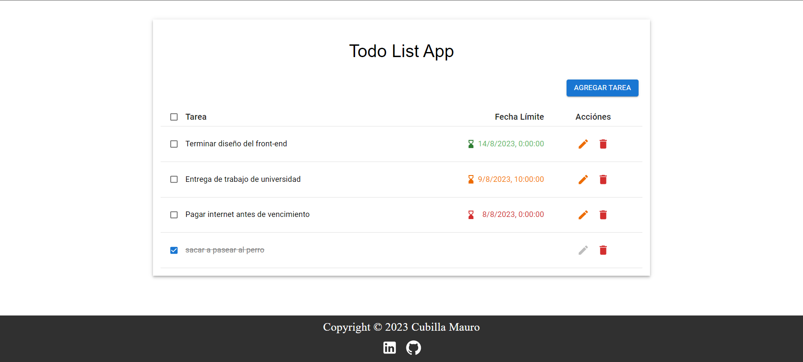
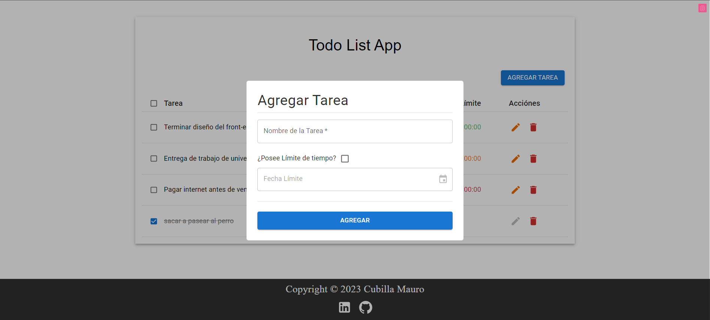

# Todo-list App / App de Listado de tareas

App para armar un listado de tareas con la posibilidad de elegir un tiempo límite. Dicha lista se almacena en el local storage
A medida se acerca la fecha límite el color de la misma ira cambiando de verde a rojo

- 1 día o menos ( Incluso se no se completo a tiempo ) = Rojo
- 2 días = naranja
- 3 días o mas = verde

## Dependencias / creditos

- react-redux
- redux/toolkit
- react-modal
- date-fns
- react-hook-form
- uuid
- Material Ui

Icono de la app tomado de aquí = https://icons8.com/icon/42824/list

## Prueba y vista previa

Pueden probarla acá: [Todo-list-app](https://todolist-macubi.netlify.app/)

Cualquier feedback/consejo es bienvenido -> [LinkedIn](https://www.linkedin.com/in/macubi90/)

